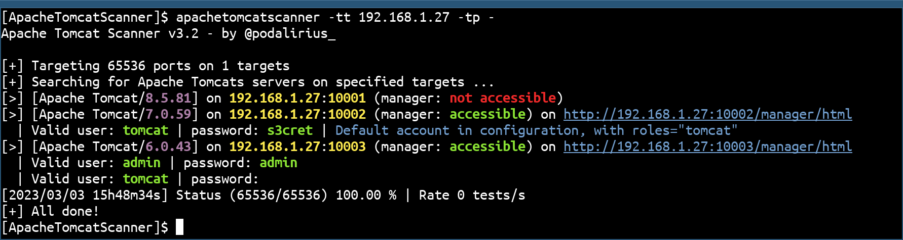
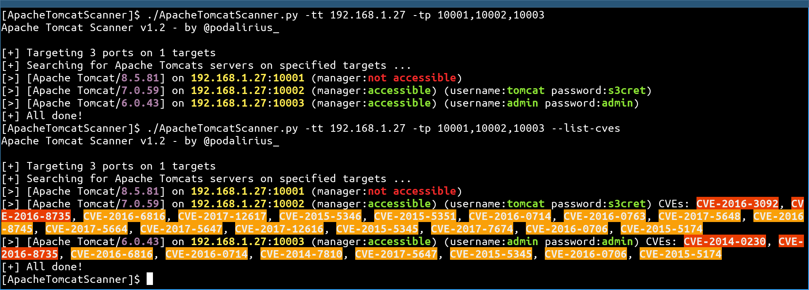

<p align="center">
  A python script to scan for Apache Tomcat server vulnerabilities.
  <br>
  
  
  
  <a href="https://twitter.com/intent/follow?screen_name=podalirius_" title="Follow"></a>
  <a href="https://www.youtube.com/c/Podalirius_?sub_confirmation=1" title="Subscribe"></a>
  <br>
</p>

## Features

 - [x] Multithreaded workers to search for Apache tomcat servers.
 - [x] Multiple target sources accepted:
    + [x] Retrieving list of computers from a Windows domain through an LDAP query to use them as a list of targets.
    + [x] Reading targets line by line from a file.
    + [x] Reading individual targets (IP/DNS/CIDR) from `-tt/--target` option. 
    + [x] Reading individual targets URLs from `-tu/--target-url` option. 
 - [x] Custom list of ports to test.
 - [x] Tests for `/manager/html` accessibility.
 - [x] Tests for default credentials to access the Tomcat Manager.
 - [x] List the CVEs of each version with the `--list-cves` option, print detailed CVEs descriptions with `--show-cves-descriptions`


## Installation

You can now install it from PyPI (latest version is ) with this command:

```
sudo python3 -m pip install apachetomcatscanner
```

## Usage

```
$ ./ApacheTomcatScanner.py -h
Apache Tomcat Scanner v3.4 - by Remi GASCOU (Podalirius)

usage: ApacheTomcatScanner.py [-h] [-v] [--debug] [-C] [--show-cves-descriptions] [-T THREADS] [-s] [--no-colors] [--only-http] [--only-https] [--export-xlsx EXPORT_XLSX] [--export-json EXPORT_JSON] [--export-sqlite EXPORT_SQLITE]
                              [-PI PROXY_IP] [-PP PROXY_PORT] [-rt REQUEST_TIMEOUT] [--tomcat-username TOMCAT_USERNAME] [--tomcat-usernames-file TOMCAT_USERNAMES_FILE] [--tomcat-password TOMCAT_PASSWORD]
                              [--tomcat-passwords-file TOMCAT_PASSWORDS_FILE] [-tf TARGETS_FILE] [-tt TARGET] [-tu TARGET_URL] [-tp TARGET_PORTS] [-ad AUTH_DOMAIN] [-ai AUTH_DC_IP] [-au AUTH_USER] [-ap AUTH_PASSWORD]
                              [-ah AUTH_HASHES] [--ldaps] [--subnets]

A python script to scan for Apache Tomcat server vulnerabilities.

options:
  -h, --help            show this help message and exit
  -v, --verbose         Verbose mode. (default: False)
  --debug               Debug mode, for huge verbosity. (default: False)
  -C, --list-cves       List CVE ids affecting each version found. (default: False)
  --show-cves-descriptions
                        Show description of found CVEs. (default: False)
  -T THREADS, --threads THREADS
                        Number of threads (default: 250)
  -s, --servers-only    If querying ActiveDirectory, only get servers and not all computer objects. (default: False)
  --no-colors           Disable colored output. (default: False)
  --only-http           Scan only with HTTP scheme. (default: False, scanning with both HTTP and HTTPs)
  --only-https          Scan only with HTTPs scheme. (default: False, scanning with both HTTP and HTTPs)

Export results:
  --export-xlsx EXPORT_XLSX
                        Output XLSX file to store the results in.
  --export-json EXPORT_JSON
                        Output JSON file to store the results in.
  --export-sqlite EXPORT_SQLITE
                        Output SQLITE3 file to store the results in.

Advanced configuration:
  -PI PROXY_IP, --proxy-ip PROXY_IP
                        Proxy IP.
  -PP PROXY_PORT, --proxy-port PROXY_PORT
                        Proxy port
  -rt REQUEST_TIMEOUT, --request-timeout REQUEST_TIMEOUT
                        Set the timeout of HTTP requests.
  --tomcat-username TOMCAT_USERNAME
                        Single tomcat username to test for login.
  --tomcat-usernames-file TOMCAT_USERNAMES_FILE
                        File containing a list of tomcat usernames to test for login
  --tomcat-password TOMCAT_PASSWORD
                        Single tomcat password to test for login.
  --tomcat-passwords-file TOMCAT_PASSWORDS_FILE
                        File containing a list of tomcat passwords to test for login

Targets:
  -tf TARGETS_FILE, --targets-file TARGETS_FILE
                        Path to file containing a line by line list of targets.
  -tt TARGET, --target TARGET
                        Target IP, FQDN or CIDR.
  -tu TARGET_URL, --target-url TARGET_URL
                        Target URL to the tomcat manager.
  -tp TARGET_PORTS, --target-ports TARGET_PORTS
                        Target ports to scan top search for Apache Tomcat servers.
  -ad AUTH_DOMAIN, --auth-domain AUTH_DOMAIN
                        Windows domain to authenticate to.
  -ai AUTH_DC_IP, --auth-dc-ip AUTH_DC_IP
                        IP of the domain controller.
  -au AUTH_USER, --auth-user AUTH_USER
                        Username of the domain account.
  -ap AUTH_PASSWORD, --auth-password AUTH_PASSWORD
                        Password of the domain account.
  -ah AUTH_HASHES, --auth-hashes AUTH_HASHES
                        LM:NT hashes to pass the hash for this user.
  --ldaps               Use LDAPS (default: False)
  --subnets             Get all subnets from the domain and use them as targets (default: False)
```

## Example



You can also list the CVEs of each version with the `--list-cves` option:



## Contributing

Pull requests are welcome. Feel free to open an issue if you want to add other features.
